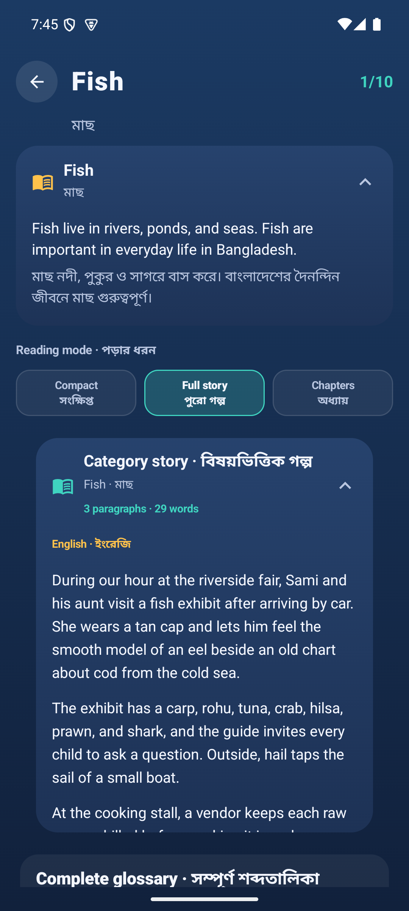
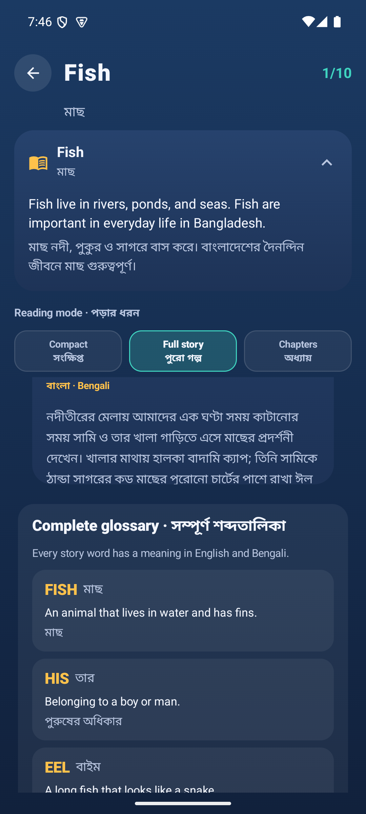

# Word Bloom category and level reading audit

Date: 2026-09-06
Surface: Android emulator `WordBloom_API_35`, debug APK
Flow: home → category grid → Fish level select → Full story → Level 2 meanings

## Audit scope

I checked the live Fish category and Level 2 screens. The focus was the reported double-scroll behavior and whether the category/level learning copy should be combined.

## User goal

Let a Bangladeshi child read one clear bilingual story, then see one complete word-meaning list, without choosing between competing scroll areas or seeing the same word explanation twice.

## Captured steps

1. **Launch screen — healthy.** The entry CTA and progress summary are clear. Evidence: `01-launch.png`.
2. **Category grid — healthy.** The category list has one expected scroll surface. Evidence: `02-categories.png`.
3. **Fish level select, compact — needs simplification.** The screen shows a separate Fish introduction card and a separate Category story card. Evidence: `03-fish-levels-top.png`.
4. **Level 2 meanings — mostly healthy, with duplication risk.** The level story shows the hero word, then the all-target-words list shows that same word again. Evidence: `05-level2-meaning.png`.
5. **Fish full story — issue confirmed.** The level-select `LazyVerticalGrid` is scrollable, and the expanded story body is independently scrollable. Evidence: `09-category-story.png` and `10-category-story-inner-scroll.png`.
6. **Fish full story after outer scroll — issue worsens.** The outer grid, expanded story, and glossary each expose a scrollable region. Evidence: `11-category-outer-scroll.png`.

## Confirmed cause

- `LevelSelectScreen` owns a `LazyVerticalGrid` for the level page (`app/src/main/java/com/ritik/wordpuzzle/ui/levelselect/LevelSelectScreen.kt:180-186`).
- `CategoryStoryCard` adds another `verticalScroll` when expanded (`app/src/main/java/com/ritik/wordpuzzle/ui/learning/LearningContent.kt:266-271`).
- `CategoryGlossaryCard` adds a third bounded scroll (`app/src/main/java/com/ritik/wordpuzzle/ui/learning/LearningContent.kt:341-348`).
- The separate `CategoryIntroCard` is rendered before the grid (`LevelSelectScreen.kt:166-173`), so the category context is split across two cards.
- The level meaning sheet has one outer scroll (`LearningContent.kt:701-712`), while `LevelLessonCard` repeats the hero word before the complete glossary (`LearningContent.kt:728-758`; `LearningContent.kt:551-610`).

## Recommendation

Yes: combine the visual descriptions. Keep the API fields for compatibility, but present one learning block per surface.

### Category level-select

1. Replace `CategoryIntroCard` plus `CategoryStoryCard` with one `CategoryLearningCard`.
2. Put the short category introduction first as a lead paragraph, then the longer bilingual story, then the category word list.
3. Rewrite the lead copy so it flows into the story. For Fish, the first English paragraph should naturally connect “Fish live in rivers, ponds, and seas…” to the riverside fair; do the same in Bengali.
4. Keep Compact / Full story / Chapters as the user option, but make every mode use the same page-level `LazyVerticalGrid` scroll.
5. Remove inner `verticalScroll` and `heightIn` from story and glossary cards. Let their content measure normally inside the grid.

### Level meaning and completion

1. Replace `LevelLessonCard` plus the glossary header/list with one `LevelLearningCard`.
2. Show the level story first.
3. Show one glossary list for every target word after the story.
4. Do not render the hero-word definition as a separate block if that word is already in the glossary; this removes the visible EEL/FISH repetition.
5. Keep one scroll owner in the meaning sheet and completion sheet. Glossary rows must not create a nested scroll.

### Data and compatibility

- Keep `introductionEn/introductionBn` and `storyEn/storyBn` in the bundled and API schemas for old servers.
- Add a presentation-level merge helper, or a new optional `displayStory` field only if the API later wants to author the merged copy directly.
- Continue validating that the merged category story contains every target word and that English/Bengali paragraphs stay aligned.
- Keep the existing level lesson and word-meaning fields as source data; only change how they are composed on screen.

## Implementation order

1. Add pure merge/dedup helpers and unit tests.
2. Build the unified category card and wire all three reading modes to the single outer scroll.
3. Make category glossary, completion story, and level glossary non-scrollable children.
4. Build the unified level learning card and remove duplicate hero-word rendering.
5. Run catalog/API/parser tests and Android unit tests.
6. Rebuild/install the debug APK and repeat this emulator flow at compact, full-story, chapters, meaning popup, and level-complete states.
7. Accept only when each screen has one obvious vertical scroll surface, the story reads naturally in both languages, and every target word still has exactly one glossary entry.

## Accessibility checks

- One scroll container gives TalkBack a predictable reading order.
- Keep the existing bilingual labels and large touch targets.
- Ensure the single story card has one expand/collapse label and the level meaning sheet has one close label.
- Verify the full glossary can be reached by swipe without focus getting trapped in a child scroll container.

## Evidence limits

This is a visual and accessibility-structure audit from the emulator and UI hierarchy. I did not run TalkBack, font-scale stress tests, or an educator review of Bengali copy in this pass.

## Verdict

The double-scroll report is confirmed. The clean fix is one merged category learning block, one merged level learning block, and one scroll owner per screen.

## Decision update: use a modal

The attached emulator view confirms that the inline Full story mode makes the level page too tall and creates several competing scroll regions. Use a modal for the long reading content.

### Proposed interaction

- **Level page:** keep the header, short category lead, reading-mode choice, and level grid. Remove the inline full story and inline glossary from this page.
- **Category story action:** add one prominent `Read category story · বিষয়ভিত্তিক গল্প` button/card. It opens a modal sheet.
- **Category story modal:** show the category lead, the full English/Bengali story, then the complete category glossary. The sheet has one scroll container, a clear close button, and a fixed title/header.
- **Level meanings action:** keep the existing book button, but use the same modal pattern. Show the level story first, then one glossary list. Do not repeat the hero-word definition above the same glossary entry.
- **Level completion:** use the same level-learning modal/card pattern rather than adding another bounded glossary scroll inside the completion overlay.

### Why this is better

It keeps the level grid easy to scan, puts long reading content in one intentional place, and gives each modal exactly one vertical scroll. It also avoids the current category introduction → story card → glossary stack shown in the attached screenshot.

### Revised implementation sequence

1. Add reusable `LearningStoryModal` with one `Column.verticalScroll` and a fixed modal header.
2. Move category story + glossary into that modal; remove inline Full story body and inline category glossary from the level grid.
3. Keep Compact / Chapters on the level page only if they remain useful; Chapters can open the same modal at the selected chapter rather than rendering every chapter inline.
4. Reuse the modal for level meanings and level completion, with one story section followed by one glossary section.
5. Keep the API/source fields unchanged and compose the category introduction as the story lead at render time.
6. Add UI/content tests for one scroll owner, one glossary entry per target word, close/back behavior, and bilingual story order.
7. Rebuild and verify: category page, category modal, level meaning modal, and completion modal at small and large content sizes.

## Astra Medium implementation plan

### Modal architecture

Use one reusable near-full-height Compose `Dialog`, not a draggable sheet. Give it a fixed header, one body `Column.verticalScroll`, and an optional fixed footer. Story paragraphs and glossary rows must not scroll themselves.

Category order: English lead + English story, Bengali lead + Bengali story, then one category glossary. Level order: bilingual level story, then one target-word glossary. Completion keeps its celebration and actions in the modal footer.

### Files and ownership

- `ui/learning/LearningContent.kt`: extract non-scrollable story/glossary sections.
- New `ui/learning/LearningStoryModal.kt`: shared modal shell and modal body.
- New `ui/learning/LearningPresentation.kt`: pure merge and glossary de-dup helpers.
- `ui/levelselect/LevelSelectScreen.kt`: replace inline story modes with a compact lead and modal action; open chapters in the modal; keep the grid as the only background scroll owner.
- `ui/game/GameScreen.kt` and `ui/game/Overlays.kt`: reuse the modal for meanings and completion; remove hero-word duplication; give modal state precedence over pause state.
- `res/values/strings.xml`: modal labels and accessibility copy.
- `StoryContentTest.kt` plus new presentation and Compose/instrumentation tests.

### Compatibility rules

Keep `introductionEn/introductionBn` and `storyEn/storyBn` in the API and bundled catalog. Merge nonblank introduction + story at presentation time. Only suppress the introduction when it exactly duplicates the story opening; do not fuzzy-remove prose.

Keep target-word order and stable case-insensitive de-duplication. Prefer catalog word meanings. Use hero metadata only to fill a missing glossary entry, never as a second visual block. Preserve found-only mode and honest empty states.

Preserve `COMPACT`, `FULL_STORY`, and `CHAPTERS` values. A saved `FULL_STORY` preference opens the modal only when the user selects it; dismissal must not reopen it. Preserve chapter unlock rules and category progress.

### Acceptance checks

- Long category, completion, and glossary content has exactly one active vertical scroll owner.
- Modal close, system Back, and completion footer actions work without accidentally pausing the game.
- Completion outside-tap does not dismiss; meaning modal outside-tap/back behavior remains intentional.
- Modal state resets or keys correctly when changing levels/categories; scroll position does not leak between lessons.
- Locked chapters stay non-interactive; unlocked chapters open their own story.
- Test empty/legacy content, CRLF text, intro-only/story-only content, duplicate hero words, large font scale, small viewport, Bengali wrapping, and TalkBack focus isolation.
- Run `./gradlew :app:testDebugUnitTest :app:assembleDebug` and repeat the live flow on `WordBloom_API_35`.

No source files were changed by this planning pass.
